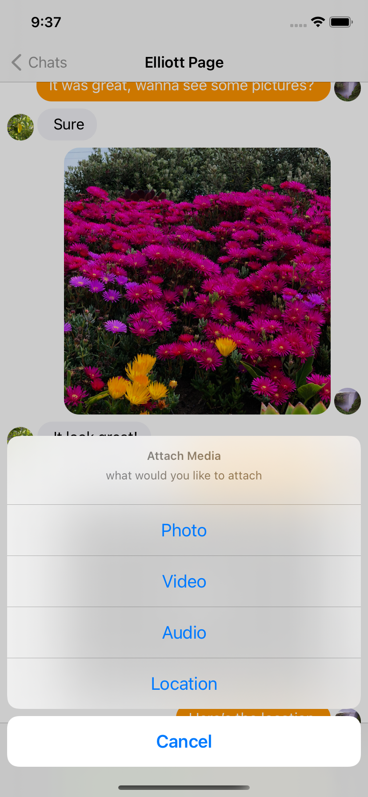

# IMessenger - Real time chat app

A beginner swift project to create a real time chat application in swift 5 using Firebase

&nbsp;&nbsp;&nbsp;&nbsp;&nbsp;&nbsp;
&nbsp;&nbsp;&nbsp;&nbsp;&nbsp;&nbsp;
&nbsp;&nbsp;&nbsp;&nbsp;&nbsp;&nbsp;

## Features
- Facebook Log in
- Google Sign in
- Email/Pass registation/ Log in
- Photo Messages
- Video Messages
- Real time conversations
- Location messages
- Search for users
- Delete conversations
- User profile
- Dark mode support
